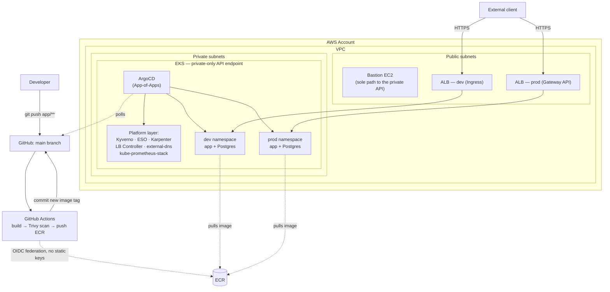

# gitops-project

A URL-shortener API running on **Amazon EKS**, deployed and operated
entirely through GitOps — two isolated environments (`dev`/`prod`)
modeled as if owned by separate teams, with a full path from `git push`
to a public, autoscaling, observable, policy-enforced endpoint.

---

## Architecture



CI/CD never touches the cluster directly — it stops at "git now reflects
the new image tag." Deployment is entirely ArgoCD's job, polling the repo
from inside the cluster and reconciling on its own. The EKS API endpoint
is private-only; the bastion is the only path in for anything imperative
(`terraform apply`, one-off `kubectl`).

---

## What's actually demonstrated

**Multi-tenancy & RBAC** — `dev`/`prod` modeled as separate teams, not
just separate namespaces: namespace-scoped `Role`/`RoleBinding` (never
`ClusterRole`), asymmetric `ResourceQuota`/`LimitRange`, and
default-deny `NetworkPolicy` with explicit allows — verified by actually
authenticating *as* each environment's `ServiceAccount` and confirming
cross-namespace access is denied with a real 403, not just configured
and assumed.

**Policy enforcement with real teeth** — Kyverno in `Enforce` mode
(non-root, no `:latest` tags, mandatory resource requests/limits),
proven by actually trying to create a violating pod and watching it get
rejected, not just checking the policy object exists.

**GitOps, IRSA everywhere** — ArgoCD App-of-Apps as the single source of
truth for everything except the initial bootstrap; every AWS-facing
identity (ESO, external-dns, the LB Controller, Karpenter, GitHub
Actions itself) is federated via OIDC, scoped to exactly the one
resource it needs — zero static AWS credentials anywhere in the system.

**Autoscaling wired to real signals** — HPA scales the app on real CPU
load; when the fixed node group runs out of pod capacity, Karpenter
provisions genuine Spot EC2 capacity on demand, with SQS/EventBridge
interruption handling so pods drain gracefully rather than vanishing.

**Observability that reacts to real state** — Prometheus scraping real
app metrics (request rate, latency) alongside platform metrics; a
Blackbox Exporter probe continuously re-testing both ALBs' actual public
HTTPS endpoints; an alert that measurably transitioned through
`Pending`/`Firing`/`Inactive` during a real outage-and-recovery cycle
hit while building this stage, not staged for effect.

**CI/CD with a real security gate** — GitHub Actions builds, Trivy-scans
(fails the pipeline on a CRITICAL finding), pushes to ECR, auto-deploys
`dev`, then waits for a human approval on a protected GitHub Environment
before promoting the identical image to `prod`.

---

## Tech stack → role

| Area | Technology | Role |
|---|---|---|
| Compute | EKS, managed node group + Karpenter | Private-API-endpoint cluster; fixed baseline capacity + Spot burst capacity |
| Networking | VPC (public/private subnets), NAT Gateway, Security Groups | Bastion-only path to a private control plane |
| GitOps | ArgoCD (App-of-Apps) | Single reconciliation loop for everything post-bootstrap |
| Policy | Kyverno | Non-root, immutable tags, mandatory resource limits — enforced, not advisory |
| Networking (in-cluster) | Kubernetes `NetworkPolicy` | Default-deny + explicit allow, dev/prod isolation |
| Secrets | AWS Secrets Manager + External Secrets Operator | DB credentials, Terraform-owned end to end |
| Ingress | AWS Load Balancer Controller — classic `Ingress` (dev) *and* Gateway API (prod) | Same controller, both mechanisms demonstrated side by side |
| Autoscaling | HPA + Karpenter (Spot) | Pod-level and node-level, both load-driven |
| Observability | kube-prometheus-stack, Blackbox Exporter | App + platform metrics, continuous external uptime probing |
| CI/CD | GitHub Actions, OIDC to AWS, Trivy | No static credentials, no unscanned images reach ECR |
| IaC | Terraform (`infra/` + `platform/` state split), Helm | AWS-API-only vs Kubernetes-API-only resources, cleanly separated |

---

## Hard problems actually hit and solved

A portfolio project's value is in defending any one of these on the
spot, not in the length of the tool list. A few of the real ones:

1. **The bastion destroyed its own IAM permissions mid-`destroy`.**
   Early on, a single flat Terraform state covered everything; Terraform
   destroys in roughly reverse-dependency order, and it deleted the
   bastion's own write policy before it had finished tearing down
   everything else — cutting the bastion off from its own ability to
   keep working, mid-operation. Fixed structurally, not with a
   permissions tweak: `infra/` (AWS-API-only, laptop-applied) and
   `platform/` (Kubernetes-API-only, bastion-applied) are now separate
   Terraform states, and the bastion's own permissions live only in the
   one state it never touches.

2. **A CRD consumer failed 100% of the time, not intermittently** — the
   first theory (a same-apply race between installing a CRD and using
   it) didn't hold up, because a genuine race would show *occasional*
   success. The real cause: the CRD served both `v1` and `v1beta1`, and
   only `v1` — the storage version — ever worked. A fully consistent
   failure pattern was the actual tell, not the assumed timing issue.

3. **Gateway API's AWS implementation has no annotation-based escape
   hatches** — three separate settings that `Ingress` gets for free via
   well-known `alb.ingress.kubernetes.io/*` annotations (target type,
   health-check path, internet-facing scheme) each needed their own
   AWS-specific CRD or explicit field once the ALB was actually
   inspected live, not assumed to "just work the same way, differently
   spelled."

4. **A working Helm chart install can still break ArgoCD silently** —
   Kyverno's CRDs are large enough that ArgoCD's default client-side
   apply (which stores the whole manifest in a `last-applied-
   configuration` annotation) exceeded Kubernetes' 262144-byte
   annotation limit. Fixed with `ServerSideApply=true`, which tracks
   ownership differently and never hits the limit.

5. **A brand-new AWS account has invisible one-time prerequisites** —
   Karpenter's first Spot launch failed with
   `AuthFailure.ServiceLinkedRoleCreationNotPermitted`: an account that
   has never launched a Spot instance doesn't have the
   `AWSServiceRoleForEC2Spot` service-linked role yet, and a workload's
   own IAM role isn't supposed to be trusted to create it.

6. **GitHub's OIDC token format wasn't what the docs implied** — an
   IAM trust policy written against the commonly-documented
   `repo:owner/repo:ref:...` subject claim failed with a generic
   "not authorized" error. The actual claim included immutable numeric
   IDs alongside the names (`owner@id/repo@id`) — confirmed by decoding
   a real token, not by trusting either documented shape.

7. **New node capacity doesn't rescue pods stuck on old, full nodes** —
   Kubernetes' scheduler only ever places a pod once, at creation time;
   it never rebalances already-running pods onto capacity that shows up
   later. When the original worker nodes filled up and Karpenter added
   more, a `node-exporter` `DaemonSet` pod (pinned to one specific,
   already-full node) stayed `Pending` indefinitely — new nodes existing
   elsewhere in the cluster made no difference to it at all. Fixed by
   manually freeing a slot on that specific node (evicting a low-stakes
   `Deployment` pod there), not by anything autoscaling-related.

---

## How to verify this yourself

Everything above is checkable directly, not just asserted. From inside
the cluster (the API endpoint is private-only, by design — see below):

```bash
# GitOps platform healthy
kubectl get application -n argocd

# Full write → read → redirect proof, both environments, from outside the cluster
curl -k -X POST https://<alb-address>/shorten -H "Content-Type: application/json" -d '{"url":"https://example.com"}'
curl -k -i https://<alb-address>/<short_code>          # expect a real 302
```

Or just open `https://<alb-address>/` directly in a browser — the app
serves a small built-in test page there (click through the self-signed-
cert warning, expected and explained below) that does the same
write → read round trip with a form and a click, no `curl` needed.

```bash
# Tenancy isolation — actually authenticate as each environment's own
# ServiceAccount, not just check RBAC config. Set up both contexts once:
CLUSTER_NAME=$(kubectl config view --minify -o jsonpath='{.clusters[0].name}')
kubectl config set-credentials dev-workload --token="$(kubectl create token dev-workload -n dev --duration=1h)"
kubectl config set-context dev --cluster="$CLUSTER_NAME" --user=dev-workload --namespace=dev
kubectl config set-credentials prod-workload --token="$(kubectl create token prod-workload -n prod --duration=1h)"
kubectl config set-context prod --cluster="$CLUSTER_NAME" --user=prod-workload --namespace=prod

kubectl config use-context dev && kubectl get pods -n prod   # expect: Forbidden

# Kyverno actually blocking a real violation, not just installed
kubectl run bad-pod -n dev --image=nginx:latest              # expect: rejected

# Autoscaling state
kubectl get hpa -n dev -n prod
kubectl get nodepool

# The original worker nodes aren't sized to hold every pod once
# Karpenter has scaled in extra nodes for the app — Kubernetes never
# rebalances already-running pods onto new capacity on its own (see
# "Hard problems" below), so this DaemonSet is the one most likely to
# have a pod stuck Pending on a node that was already full before the
# scale-out (see "Hard problems" above). If any show Pending, confirm
# they can actually schedule (check `kubectl describe pod <name> -n
# observability` for "Too many pods", then free a slot on that specific
# node — evicting a low-stakes Deployment pod there, e.g. one with no
# PVC — rather than assuming the whole DaemonSet is unhealthy):
kubectl get pods -n observability -l app.kubernetes.io/name=prometheus-node-exporter

# Real metrics and a real continuous uptime probe, in Grafana's Explore tab
up{namespace=~"dev|prod"}
probe_success{job="blackbox-alb-uptime"}
```

The full CI/CD path is checkable by pushing any change under `app/` and
watching the Actions tab: Trivy scan → ECR push → auto-commit to
`values-dev.yaml` → dev rollout → a pause on the `production`
Environment waiting for manual approval.

---

## Repo structure

```
terraform/
  bootstrap/   one-time, account-wide (state bucket, Spot service-linked role)
  infra/       AWS-API-only — VPC, EKS, bastion, IAM/OIDC, ECR — laptop-applied
  platform/    Kubernetes-API-only — ArgoCD, IRSA roles, CRD bootstraps — bastion-applied
k8s-apps/      everything ArgoCD syncs post-bootstrap: tenancy, storage, the app,
               ingress/gateway, policy, observability — plain YAML, no templating
helm-charts/   the app's own Helm chart (Deployment, Postgres StatefulSet, HPA)
app/           the Flask app itself
.github/workflows/   CI/CD pipeline
```

---

## What this is (and isn't)

This is a deliberately-built learning and portfolio project — not
production experience, no real user traffic, no on-call. Several
choices reflect that honestly rather than pretending otherwise: a
self-signed certificate instead of a real CA (no owned domain), a
single shared NAT Gateway instead of one per AZ (no real traffic to
protect against an AZ outage), no notification channel wired to the
uptime alert (the alert firing and clearing is the proof; a Slack
integration doesn't teach anything new about this project's own
architecture). Every one of these is a named, deliberate tradeoff, not
an oversight — and each is something I can walk through in detail,
including the alternative and why it was set aside.
