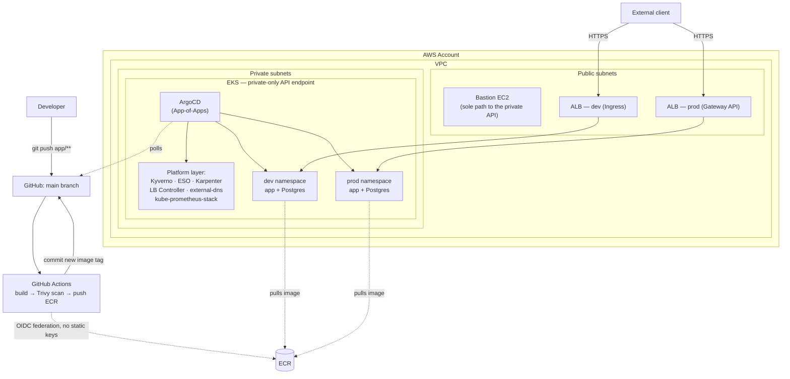

# gitops-project

A URL-shortener API running on **Amazon EKS**, deployed and operated
entirely through GitOps — two isolated environments (`dev`/`prod`)
modeled as if owned by separate teams, with a full path from `git push`
to a public, autoscaling, observable, policy-enforced endpoint.

---

## Architecture



CI/CD never touches the cluster directly — it stops at "git now reflects
the new image tag." Deployment is entirely ArgoCD's job, polling the repo
from inside the cluster and reconciling on its own. The EKS API endpoint
is private-only; the bastion is the only path in for anything imperative
(`terraform apply`, one-off `kubectl`).

---

## What's actually demonstrated

**Multi-tenancy & RBAC** — `dev`/`prod` modeled as separate teams, not
just separate namespaces: namespace-scoped `Role`/`RoleBinding` (never
`ClusterRole`), asymmetric `ResourceQuota`/`LimitRange`, and
default-deny `NetworkPolicy` with explicit allows — verified by actually
authenticating *as* each environment's `ServiceAccount` and confirming
cross-namespace access is denied with a real 403, not just configured
and assumed.

**Policy enforcement with real teeth** — Kyverno in `Enforce` mode
(non-root, no `:latest` tags, mandatory resource requests/limits),
proven by actually trying to create a violating pod and watching it get
rejected, not just checking the policy object exists.

**GitOps, IRSA everywhere** — ArgoCD App-of-Apps as the single source of
truth for everything except the initial bootstrap; every AWS-facing
identity (ESO, external-dns, the LB Controller, Karpenter, GitHub
Actions itself) is federated via OIDC, scoped to exactly the one
resource it needs — zero static AWS credentials anywhere in the system.

**Autoscaling wired to real signals** — HPA scales the app on real CPU
load; when the fixed node group runs out of pod capacity, Karpenter
provisions genuine Spot EC2 capacity on demand, with SQS/EventBridge
interruption handling so pods drain gracefully rather than vanishing.

**Observability that reacts to real state** — Prometheus scraping real
app metrics (request rate, latency) alongside platform metrics; a
Blackbox Exporter probe continuously re-testing both ALBs' actual public
HTTPS endpoints; an alert that measurably transitioned through
`Pending`/`Firing`/`Inactive` during a real outage-and-recovery cycle
hit while building this stage, not staged for effect.

**CI/CD with a real security gate** — GitHub Actions builds, Trivy-scans
(fails the pipeline on a CRITICAL finding), pushes to ECR, auto-deploys
`dev`, then waits for a human approval on a protected GitHub Environment
before promoting the identical image to `prod`.

---

## Tech stack → role

| Area | Technology | Role |
|---|---|---|
| Compute | EKS, managed node group + Karpenter | Private-API-endpoint cluster; fixed baseline capacity + Spot burst capacity |
| Networking | VPC (public/private subnets), NAT Gateway, Security Groups | Bastion-only path to a private control plane |
| GitOps | ArgoCD (App-of-Apps) | Single reconciliation loop for everything post-bootstrap |
| Policy | Kyverno | Non-root, immutable tags, mandatory resource limits — enforced, not advisory |
| Networking (in-cluster) | Kubernetes `NetworkPolicy` | Default-deny + explicit allow, dev/prod isolation |
| Secrets | AWS Secrets Manager + External Secrets Operator | DB credentials, Terraform-owned end to end |
| Ingress | AWS Load Balancer Controller — classic `Ingress` (dev) *and* Gateway API (prod) | Same controller, both mechanisms demonstrated side by side |
| Autoscaling | HPA + Karpenter (Spot) | Pod-level and node-level, both load-driven |
| Observability | kube-prometheus-stack, Blackbox Exporter | App + platform metrics, continuous external uptime probing |
| CI/CD | GitHub Actions, OIDC to AWS, Trivy | No static credentials, no unscanned images reach ECR |
| IaC | Terraform (`infra/` + `platform/` state split), Helm | AWS-API-only vs Kubernetes-API-only resources, cleanly separated |

---

## Repo structure

```
terraform/
  bootstrap/   one-time, account-wide (state bucket, Spot service-linked role)
  infra/       AWS-API-only — VPC, EKS, bastion, IAM/OIDC, ECR — laptop-applied
  platform/    Kubernetes-API-only — ArgoCD, IRSA roles, CRD bootstraps — bastion-applied
k8s-apps/      everything ArgoCD syncs post-bootstrap: tenancy, storage, the app,
               ingress/gateway, policy, observability — plain YAML, no templating
helm-charts/   the app's own Helm chart (Deployment, Postgres StatefulSet, HPA)
app/           the Flask app itself
.github/workflows/   CI/CD pipeline
```

---

## What this is (and isn't)

This is a deliberately-built learning and portfolio project. Several
choices reflect that honestly rather than pretending otherwise:

- A self-signed certificate instead of a real CA (no owned domain).
- A single shared NAT Gateway instead of one per AZ (no real traffic to
  protect against an AZ outage).
- No AWS PrivateLink/VPC interface endpoints for ECR, STS, Secrets
  Manager, or EC2 — that traffic goes out through the NAT Gateway over
  the public internet instead. Each interface endpoint carries its own
  hourly charge, not worth it for a demo project with no real traffic
  to keep off the public path.
- No notification channel wired to the uptime alert — the alert firing
  and clearing is the proof; no Slack/email integration.

Every one of these is a named, deliberate tradeoff, not an oversight.

---

## Getting started - fresh

### Prerequisites

- AWS CLI v2, Terraform >= 1.11.0, `kubectl`, `git`, an SSH client
- An AWS account with sufficiently broad IAM permissions for the initial
  setup (this project's own laptop-side identity is a plain admin-level
  IAM user)
- [`gh`](https://cli.github.com/) (optional — used later to trigger the
  CI/CD pipeline manually)

### 1. AWS credentials and SSH key

```bash
aws configure --profile gitops-project
ssh-keygen -t ed25519 -f ~/.ssh/gitops-project-bastion -N ""
```

### 2. Clone the repo

```bash
git clone https://github.com/shtemeron/gitops-project.git
cd gitops-project
```

### 3. Bootstrap — one-time, account-wide

Creates the Terraform state S3 bucket and the `AWSServiceRoleForEC2Spot`
service-linked role Karpenter needs later.

```bash
cd terraform/bootstrap
AWS_PROFILE=gitops-project terraform init
AWS_PROFILE=gitops-project terraform apply
cd ../..
```

### 4. Create `terraform/infra/terraform.tfvars`

Gitignored, environment-specific — three variables have no default and
must be set here:

```hcl
bastion_allowed_ssh_cidr = "0.0.0.0/0"    # or your own IP/32, tighter
bastion_public_key_path  = "~/.ssh/gitops-project-bastion.pub"
aws_profile              = "gitops-project"
```

### 5. Apply `infra/` (from the laptop)

```bash
cd terraform/infra
terraform init
terraform apply

terraform output bastion_public_ip
terraform output dev_acm_certificate_arn
terraform output prod_acm_certificate_arn
```
Creates the VPC, the private-API-endpoint EKS cluster, the bastion, ECR,
self-signed ACM certs, and the GitHub Actions OIDC role — note the
three outputs above, needed in the next few steps.

### 6. SSH to the bastion and clone the repo there too

```bash
ssh -i ~/.ssh/gitops-project-bastion ec2-user@<bastion_public_ip>
git clone https://github.com/shtemeron/gitops-project.git ~/gitops-project
```

### 7. Build and push the first app image

The ECR repo is empty and there's no existing commit to trigger the
CI/CD pipeline's `push` filter yet — trigger it manually instead (the
GitHub Actions IAM role from step 5 already exists by this point):
```bash
gh workflow run ci-cd.yml --ref main
```
Wait for it to finish `build-scan-push` → `deploy-dev`, then approve the
`production` Environment prompt in the Actions UI to also populate
`values-prod.yaml`. (No `gh`/GitHub Actions available yet? The manual
`docker build`/`push` fallback is in `RUNBOOK.md`.)

### 8. Create `terraform/platform/terraform.tfvars` (on the bastion)

```hcl
aws_profile = "gitops-project"
```

### 9. Sync the ACM ARNs into `k8s-apps/`

New certs mean new ARNs — compare step 5's two outputs against what's
hardcoded in `k8s-apps/gateway/prod-lbconfig.yaml`
(`defaultCertificate:`) and `k8s-apps/ingress/dev-ingress.yaml`
(`alb.ingress.kubernetes.io/certificate-arn`). Edit, commit, push
**before** step 10.

### 10. Apply `platform/` (from the bastion)

```bash
cd terraform/platform
terraform init
terraform apply
```
Installs ArgoCD, ESO, `external-dns`, the AWS Load Balancer Controller,
and the App-of-Apps root — from here, ArgoCD syncs everything else
under `k8s-apps/` on its own (tenancy, storage, the app, Kyverno,
Karpenter, observability). No further `terraform apply` or `kubectl
apply` needed for any of it.

### 11. Sync the Blackbox probe targets

Only possible once step 10 has actually provisioned both ALBs:
```bash
kubectl get gateway -n prod -o jsonpath='{.status.addresses[0].value}'
kubectl get ingress -n dev -o jsonpath='{.status.loadBalancer.ingress[0].hostname}'
```
Edit the real addresses into `k8s-apps/observability/probe-blackbox.yaml`,
commit, push.

### 12. One-time GitHub-side setup (any time before you need the prod gate)

`Environment` protection rules only work on private repos with GitHub
Pro/Team — on the Free plan the repo needs to be **public** for
Settings → Environments to even appear. Once public: create a
`production` Environment with a required-reviewers rule — this is what
actually gates the CI/CD pipeline's promotion to `prod`.

### 13. Verify

Move on to **[How to verify this yourself](#how-to-verify-this-yourself)**
below.

---

## How to verify this yourself

Everything above is checkable directly, not just asserted. From inside
the cluster (the API endpoint is private-only, by design — see above):

```bash
# GitOps platform healthy
kubectl get application -n argocd

# Full write → read → redirect proof, both environments, from outside the cluster
curl -k -X POST https://<alb-address>/shorten -H "Content-Type: application/json" -d '{"url":"https://example.com"}'
curl -k -i https://<alb-address>/<short_code>          # expect a real 302
```

Or just open `https://<alb-address>/` directly in a browser — the app
serves a small built-in test page there (click through the self-signed-
cert warning, expected and explained above) that does the same
write → read round trip with a form and a click, no `curl` needed.

```bash
# Tenancy isolation — actually authenticate as each environment's own
# ServiceAccount, not just check RBAC config. Set up both contexts once:
CLUSTER_NAME=$(kubectl config view --minify -o jsonpath='{.clusters[0].name}')
kubectl config set-credentials dev-workload --token="$(kubectl create token dev-workload -n dev --duration=1h)"
kubectl config set-context dev --cluster="$CLUSTER_NAME" --user=dev-workload --namespace=dev
kubectl config set-credentials prod-workload --token="$(kubectl create token prod-workload -n prod --duration=1h)"
kubectl config set-context prod --cluster="$CLUSTER_NAME" --user=prod-workload --namespace=prod

kubectl config use-context dev && kubectl get pods -n prod   # expect: Forbidden

# Kyverno actually blocking a real violation, not just installed
kubectl run bad-pod -n dev --image=nginx:latest              # expect: rejected

# Autoscaling state
kubectl get hpa -n dev -n prod
kubectl get nodepool

# The original worker nodes aren't sized to hold every pod once
# Karpenter has scaled in extra nodes for the app — Kubernetes never
# rebalances already-running pods onto new capacity on its own, so this
# DaemonSet is the one most likely to have a pod stuck Pending on a node
# that was already full before the scale-out. If any show Pending,
# confirm they can actually schedule (check `kubectl describe pod
# <name> -n observability` for "Too many pods", then free a slot on
# that specific node — evicting a low-stakes Deployment pod there, e.g.
# one with no PVC — rather than assuming the whole DaemonSet is
# unhealthy):
kubectl get pods -n observability -l app.kubernetes.io/name=prometheus-node-exporter

# Real metrics and a real continuous uptime probe, in Grafana's Explore tab
up{namespace=~"dev|prod"}
probe_success{job="blackbox-alb-uptime"}
```

The full CI/CD path is checkable by pushing any change under `app/` and
watching the Actions tab: Trivy scan → ECR push → auto-commit to
`values-dev.yaml` → dev rollout → a pause on the `production`
Environment waiting for manual approval.
