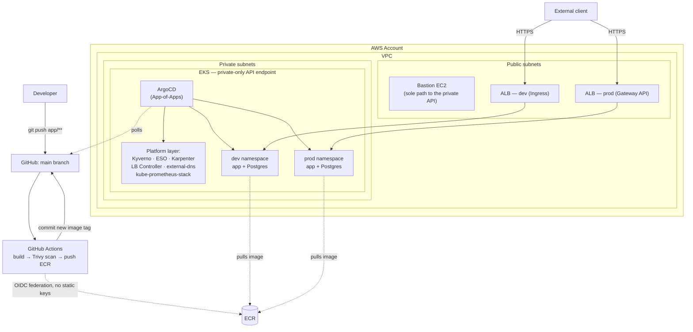

# gitops-project

A URL-shortener API running on **Amazon EKS**, deployed and operated
entirely through GitOps — two isolated environments (`dev`/`prod`)
modeled as if owned by separate teams, with a full path from `git push`
to a public, autoscaling, observable, policy-enforced endpoint.

---

## Architecture



CI/CD never touches the cluster directly — it stops at "git now reflects
the new image tag." Deployment is entirely ArgoCD's job, polling the repo
from inside the cluster and reconciling on its own. The EKS API endpoint
is private-only; the bastion is the only path in for anything imperative
(`terraform apply`, one-off `kubectl`).

---

## What's actually demonstrated

**Multi-tenancy & RBAC** — `dev`/`prod` modeled as separate teams, not
just separate namespaces: namespace-scoped `Role`/`RoleBinding` (never
`ClusterRole`), asymmetric `ResourceQuota`/`LimitRange`, and
default-deny `NetworkPolicy` with explicit allows — verified by actually
authenticating *as* each environment's `ServiceAccount` and confirming
cross-namespace access is denied with a real 403, not just configured
and assumed.

**Policy enforcement with real teeth** — Kyverno in `Enforce` mode
(non-root, no `:latest` tags, mandatory resource requests/limits),
proven by actually trying to create a violating pod and watching it get
rejected, not just checking the policy object exists.

**GitOps, IRSA everywhere** — ArgoCD App-of-Apps as the single source of
truth for everything except the initial bootstrap; every AWS-facing
identity (ESO, external-dns, the LB Controller, Karpenter, GitHub
Actions itself) is federated via OIDC, scoped to exactly the one
resource it needs — zero static AWS credentials anywhere in the system.

**Autoscaling wired to real signals** — HPA scales the app on real CPU
load; when the fixed node group runs out of pod capacity, Karpenter
provisions genuine Spot EC2 capacity on demand, with SQS/EventBridge
interruption handling so pods drain gracefully rather than vanishing.

**Observability that reacts to real state** — Prometheus scraping real
app metrics (request rate, latency) alongside platform metrics; a
Blackbox Exporter probe continuously re-testing both ALBs' actual public
HTTPS endpoints; an alert that measurably transitioned through
`Pending`/`Firing`/`Inactive` during a real outage-and-recovery cycle
hit while building this stage, not staged for effect.

**CI/CD with a real security gate** — GitHub Actions builds, Trivy-scans
(fails the pipeline on a CRITICAL finding), pushes to ECR, auto-deploys
`dev`, then waits for a human approval on a protected GitHub Environment
before promoting the identical image to `prod`.

---

## Tech stack → role

| Area | Technology | Role |
|---|---|---|
| Compute | EKS, managed node group + Karpenter | Private-API-endpoint cluster; fixed baseline capacity + Spot burst capacity |
| Networking | VPC (public/private subnets), NAT Gateway, Security Groups | Bastion-only path to a private control plane |
| GitOps | ArgoCD (App-of-Apps) | Single reconciliation loop for everything post-bootstrap |
| Policy | Kyverno | Non-root, immutable tags, mandatory resource limits — enforced, not advisory |
| Networking (in-cluster) | Kubernetes `NetworkPolicy` | Default-deny + explicit allow, dev/prod isolation |
| Secrets | AWS Secrets Manager + External Secrets Operator | DB credentials, Terraform-owned end to end |
| Ingress | AWS Load Balancer Controller — classic `Ingress` (dev) *and* Gateway API (prod) | Same controller, both mechanisms demonstrated side by side |
| Autoscaling | HPA + Karpenter (Spot) | Pod-level and node-level, both load-driven |
| Observability | kube-prometheus-stack, Blackbox Exporter | App + platform metrics, continuous external uptime probing |
| CI/CD | GitHub Actions, OIDC to AWS, Trivy | No static credentials, no unscanned images reach ECR |
| IaC | Terraform (`infra/` + `platform/` state split), Helm | AWS-API-only vs Kubernetes-API-only resources, cleanly separated |

---

## Repo structure

```
terraform/
  bootstrap/   one-time, account-wide (state bucket, Spot service-linked role)
  infra/       AWS-API-only — VPC, EKS, bastion, IAM/OIDC, ECR — laptop-applied
  platform/    Kubernetes-API-only — ArgoCD, IRSA roles, CRD bootstraps — bastion-applied
k8s-apps/      everything ArgoCD syncs post-bootstrap: tenancy, storage, the app,
               ingress/gateway, policy, observability — plain YAML, no templating
helm-charts/   the app's own Helm chart (Deployment, Postgres StatefulSet, HPA)
app/           the Flask app itself
.github/workflows/   CI/CD pipeline
```

---

## What this is (and isn't)

This is a deliberately-built learning and portfolio project. Several
choices reflect that honestly rather than pretending otherwise:

- A self-signed certificate instead of a real CA (no owned domain).
- A single shared NAT Gateway instead of one per AZ (no real traffic to
  protect against an AZ outage).
- No AWS PrivateLink/VPC interface endpoints for ECR, STS, Secrets
  Manager, or EC2 — that traffic goes out through the NAT Gateway over
  the public internet instead. Each interface endpoint carries its own
  hourly charge, not worth it for a demo project with no real traffic
  to keep off the public path.
- No notification channel wired to the uptime alert — the alert firing
  and clearing is the proof; no Slack/email integration.

Every one of these is a named, deliberate tradeoff, not an oversight.

---

## Deploying and verifying this yourself

Full step-by-step deployment instructions (fresh laptop, fresh AWS
account) and a complete verification checklist live in
[`INSTRUCTIONS.md`](INSTRUCTIONS.md), kept separate from this file so
the architecture/design write-up above stays focused.
